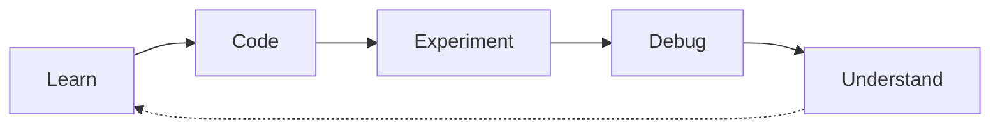

# 🐍 Python Learning Journey

A hands-on repository documenting my journey of learning Python from scratch. This project contains my practice code, experiments, and notes as I progress through different chapters and topics.


## 📊 Learning Progress

<!-- PROGRESS:START -->
**Python Learning Progress**

`██░░░░░░░░░░░░░░░░░░ 14%`

*4 / 28 chapters completed*
<!-- PROGRESS:END -->

*Progress is automatically tracked using `scripts/update_progress.py`, which detects completed chapters based on the presence of `chapterX.py` files.*

## 🗺️ Learning Roadmap & Index

The roadmap is based on the comprehensive notes provided in `learning_python_notes.html`.

### 🔹 Fundamentals
- [x] **Chapter 01:** Installation
- [x] **Chapter 02:** Comments & Variables
- [x] **Chapter 03:** Data Types
- [x] **Chapter 04:** Strings & Type Conversion
- [ ] **Chapter 05:** Input, Output & Operators

### 🔹 Control Flow
- [ ] **Chapter 06:** Conditional Statements
- [ ] **Chapter 07:** Loops
- [ ] **Chapter 08:** For Loop
- [ ] **Chapter 09:** While Loop

### 🔹 Functions & Data Structures
- [ ] **Chapter 10:** Functions
- [ ] **Chapter 11:** Data Structures
- [ ] **Chapter 12:** List
- [ ] **Chapter 13:** Tuple
- [ ] **Chapter 14:** Set
- [ ] **Chapter 15:** Dictionary

### 🔹 Advanced Operations
- [ ] **Chapter 16:** Exception Handling
- [ ] **Chapter 17:** File Handling

### 🔹 Object-Oriented Programming (OOP)
- [ ] **Chapter 18:** OOP in Python
- [ ] **Chapter 19:** Classes
- [ ] **Chapter 20:** Objects
- [ ] **Chapter 21:** Constructor
- [ ] **Chapter 22:** Attributes & Methods
- [ ] **Chapter 23:** Inheritance
- [ ] **Chapter 24:** Polymorphism
- [ ] **Chapter 25:** Encapsulation
- [ ] **Chapter 26:** Abstraction
- [ ] **Chapter 27:** Dunder Methods

### 🔹 Next Steps
- [ ] **Chapter 28:** Advanced Topics

## 📂 Repository Structure

```text
📦 learning_python
 ┣ 📜 learning_python_notes.html  # Comprehensive course notes
 ┣ 📜 chapter2.py                 # Comments & Variables
 ┣ 📜 chapter3.py                 # Data Types
 ┣ 📜 chapter4.py                 # Strings & Type Conversion
 ┣ 📂 scripts
 ┃ ┗ 📜 update_progress.py        # Automation script to update README
 ┗ 📜 README.md                   # This file
```

## 🔄 Learning Approach

My learning workflow is simple and iterative:



1. **Learn:** Read the chapter notes in `learning_python_notes.html`.
2. **Code:** Write the code in a dedicated `chapterX.py` file.
3. **Experiment:** Modify the code to see what breaks or how things behave differently.
4. **Debug:** Fix errors to understand the core mechanics.
5. **Understand:** Cement the concepts and move on to the next chapter.

## 🛠️ How to Update Progress

When a new chapter is completed, a new `chapterX.py` file is added.
To update the progress bar in this README, simply run the automation script:

```bash
python scripts/update_progress.py
```
This script will scan the repository, calculate the completion percentage, and automatically update the **Learning Progress** section above!
